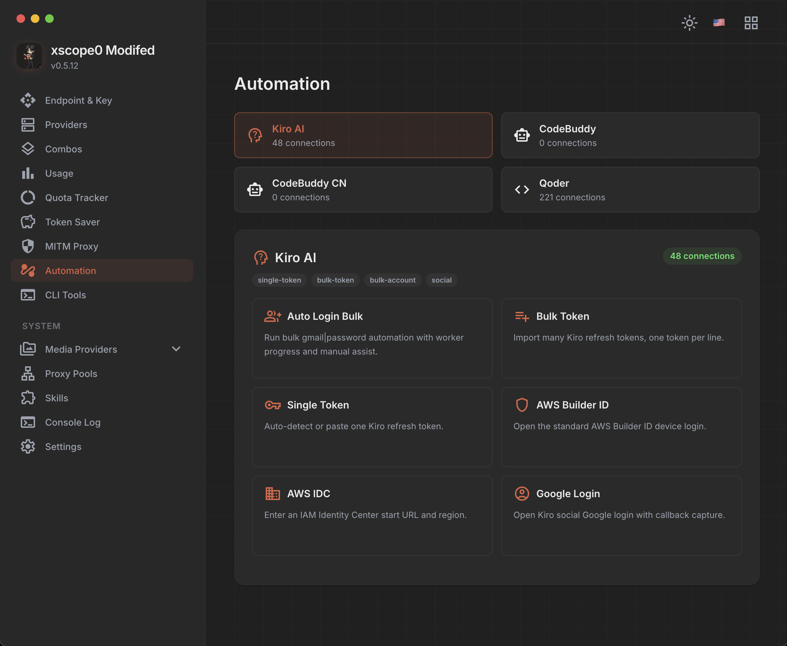
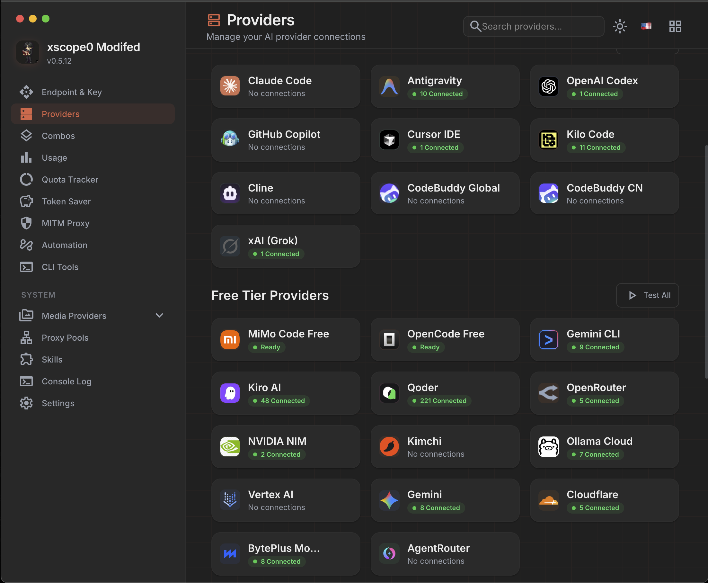

# xscope0 Modifed Router

Forked from [9router](https://github.com/decolua/9router).

## Preview





Extra features in this build:

- xscope0 Modifed branding.
- Pi provider setup with fixed local endpoint: `http://localhost:20128/v1`.
- TokenSaver path hardened: RTK, Headroom, Caveman, Ponytail flags.
- Visible Caveman/Ponytail request logs.
- Mimo Code Free + OpenCode Free proxy automation:
  - choose proxy pool
  - auto-rotate every 5/10/15 minutes
  - rotate to next proxy on rate-limit / provider errors, including Mimo 400/441
- Provider-wide `Error → inactive` policy for account providers.
- Bulk account tools:
  - delete selected accounts
  - delete inactive/deactivated accounts
- Kiro temporary suspension handling.
- Proxy pool force-delete unbinds accounts first.
- Bulk API key import appends keys instead of replacing same-name accounts.
- Donate / Remote UI removed.
- Updated provider icons.

## Install

```bash
npm install -g xscope0-modifed-router
9router
```

Or:

```bash
npx xscope0-modifed-router
```

Dashboard:

```text
http://localhost:20128/dashboard
```

API endpoint:

```text
http://localhost:20128/v1
```

## Build

```bash
npm install
npm run build
npm pack
```

## Notes

Package keeps the `9router` binary for compatibility and also exposes:

```bash
xscope0-router
```

License: MIT. Original project: 9router.
